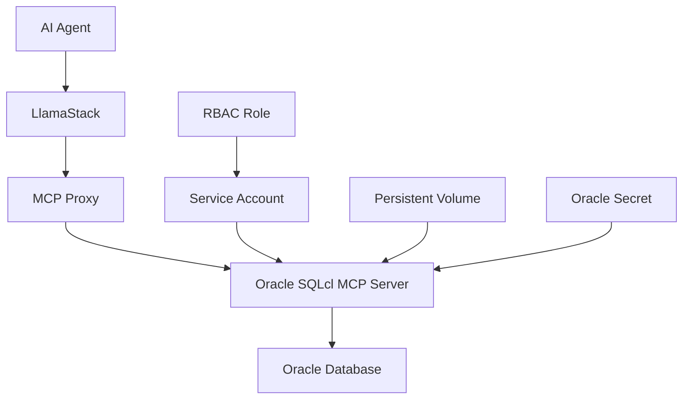

# Oracle SQLcl MCP Server

## 🚀 Overview

The Oracle SQLcl MCP Server enables AI agents to interact with Oracle databases through natural language queries. This server implements the Model Context Protocol (MCP) to provide database connectivity and SQL execution capabilities for AI-powered applications.

## ✨ Features

- **🔗 Database Connectivity**: Direct connection to Oracle databases using SQLcl
- **🤖 AI Integration**: Natural language to SQL query conversion
- **🔒 Secure Access**: Service account-based authentication with RBAC
- **💾 Persistent Storage**: 5Gi PVC for SQLcl home directory
- **⏱️ Dependency Management**: Init containers for Oracle secret and job validation
- **🛡️ Security**: Pod security contexts and capability restrictions

## 🏗️ Architecture



## 📋 Prerequisites

### Required Components
- **Toolhive Operator**: MCP server lifecycle management (MUST be installed first)
- **Oracle Database**: Oracle 23ai or compatible version
- **Kubernetes Cluster**: OpenShift or standard Kubernetes
- **Storage Class**: `gp3-csi` or compatible storage class

### Installing Toolhive Operator

Before deploying the Oracle MCP server, you must install the Toolhive operator:

```bash
# Install Toolhive operator
helm repo add toolhive https://stacklok.github.io/toolhive
helm repo update

# Install Toolhive operator
helm install toolhive toolhive/toolhive-operator \
  --namespace toolhive-system \
  --create-namespace \
  --wait

# Verify installation
kubectl get pods -n toolhive-system
```

### Required Secrets
- **oracle23ai**: Contains Oracle database credentials
  - `password`: Oracle database password
  - `jdbc-uri`: Oracle JDBC connection string

## 🚀 Deployment

### Quick Start

1. **Set Environment Variables**:
   ```bash
   export ADMIN_USERNAME=your-admin
   export ADMIN_EMAIL=your-email@company.com
   export HF_TOKEN=your-huggingface-token
   export NAMESPACE=your-namespace
   export ORACLE=true
   ```

2. **Deploy with Oracle Integration**:
   ```bash
   cd ai-virtual-agent/deploy/cluster
   make install NAMESPACE=$NAMESPACE ORACLE=true
   ```

### Manual Configuration

#### Enable Oracle MCP Server
```yaml
# In mcp-servers/helm/values.yaml
mcp-servers:
  oracle-sqlcl:
    enabled: true
    deploymentMode: mcpserver  # Uses Toolhive operator
    image:
      repository: quay.io/rh-ai-quickstart/oracle-sqlcl
      tag: ""  # Defaults to .Chart.Version
    port: 8080
    transport: stdio
```

#### MCP Server Image Details
The Oracle MCP server uses the `quay.io/rh-ai-quickstart/oracle-sqlcl` image which includes:
- **Oracle SQLcl**: Command-line interface for Oracle databases
- **MCP Server Implementation**: Model Context Protocol server for AI integration
- **Startup Script**: Automatically creates named connections during pod initialization
- **Java Runtime**: Optimized JVM configuration for database operations

#### Service Account Configuration
```yaml
serviceAccount:
  name: "oracle-sqlcl-sa"  # Use existing service account
  createServiceAccount: false  # Toolhive creates it automatically
```

#### Environment Variables
```yaml
env:
  ORACLE_USER: "system"
  ORACLE_PASSWORD: null  # Sourced from secret
  ORACLE_CONNECTION_STRING: null  # Sourced from secret
  ORACLE_CONN_NAME: oracle_connection
  JAVA_TOOL_OPTIONS: "-Djava.io.tmpdir=/sqlcl-home/tmp"
  HOME: "/sqlcl-home"
envSecrets:
  ORACLE_PASSWORD:
    name: oracle23ai
    key: password
  ORACLE_CONNECTION_STRING:
    name: oracle23ai
    key: jdbc-uri
```

#### Wait Conditions
```yaml
waitFor:
  - name: oracle23ai
    type: secret
    timeout: 300
    interval: 5
  - name: oracle23ai-tpcds-populate
    type: job
    timeout: 1800
    interval: 10
```

## 🔧 Configuration

### Named Connections and Startup Process

The Oracle MCP server automatically creates named connections during startup using the startup script (`start-mcp.sh`). This process:

1. **Environment Variable Validation**: Checks for required Oracle connection parameters
2. **Connection Creation**: Creates a saved connection using SQLcl's `connect -savepwd -save` command
3. **Connection Verification**: Validates the connection was created successfully
4. **MCP Server Launch**: Starts the MCP server with the saved connection available

#### Default Named Connection
- **Connection Name**: `oracle_connection` (configurable via `ORACLE_CONN_NAME`)
- **User**: `system` (configurable via `ORACLE_USER`)
- **Connection String**: Extracted from `ORACLE_CONNECTION_STRING` environment variable
- **Password**: Stored securely using `-savepwd` flag

#### Managing Named Connections in Oracle MCP Pod

**List All Named Connections**:
```bash
# Using SQLcl command
kubectl exec oracle-sqlcl-0 -c mcp -- /opt/oracle/sqlcl/bin/sql /NOLOG -c "connmgr list"

# Using MCP server tool
kubectl exec oracle-sqlcl-0 -c mcp -- /opt/oracle/sqlcl/bin/sql /NOLOG -c "list-connections"
```

**Show Specific Connection Details**:
```bash
# Show connection details
kubectl exec oracle-sqlcl-0 -c mcp -- /opt/oracle/sqlcl/bin/sql /NOLOG -c "connmgr show oracle_connection"

# Test connection
kubectl exec oracle-sqlcl-0 -c mcp -- /opt/oracle/sqlcl/bin/sql /NOLOG -c "connect oracle_connection"
```

**Create Additional Named Connections**:
```bash
# Create a new named connection
kubectl exec oracle-sqlcl-0 -c mcp -- /opt/oracle/sqlcl/bin/sql /NOLOG -c "connect -savepwd -save my_connection username/password@host:port/service"
```

**Connection Storage Location**:
- **SQLcl Home**: `/sqlcl-home/.sqlcl/aliases.xml`
- **DBTools Connections**: `/sqlcl-home/.dbtools/connections/`
- **Persistent Storage**: 5Gi PVC ensures connections survive pod restarts

### Environment Variables

| Variable | Description | Default | Required |
|----------|-------------|---------|----------|
| `ORACLE_USER` | Oracle database user | `SYSTEM` | ✅ |
| `ORACLE_PASSWORD` | Oracle database password | From secret | ✅ |
| `ORACLE_CONNECTION_STRING` | JDBC connection string | From secret | ✅ |
| `ORACLE_CONN_NAME` | Named connection name | `oracle_connection` | ✅ |
| `JAVA_TOOL_OPTIONS` | JVM options | `-Djava.io.tmpdir=/sqlcl-home/tmp` | ❌ |
| `HOME` | SQLcl home directory | `/sqlcl-home` | ❌ |

### Resource Configuration
```yaml
resources:
  requests:
    cpu: 500m
    memory: 512Mi
  limits:
    cpu: 1000m
    memory: 1Gi
```

### Storage Configuration
```yaml
volumes:
  - name: sqlcl-data
    ephemeral:
      volumeClaimTemplate:
        spec:
          accessModes:
            - ReadWriteOnce
          storageClassName: gp3-csi
          resources:
            requests:
              storage: 5Gi
volumeMounts:
  - name: sqlcl-data
    mountPath: /sqlcl-home
```

## 🧪 Testing

### 1. Verify Deployment
```bash
# Check MCP server pod
kubectl get pods -l app.kubernetes.io/name=oracle-sqlcl

# Check MCPServer resource
kubectl get mcpserver oracle-sqlcl

# Check service account (created by Toolhive)
kubectl get serviceaccount oracle-sqlcl-sa
```

### 2. Test Database Connection
```bash
# Check pod logs for connection status
kubectl logs oracle-sqlcl-0 -c mcp

# Test saved connection
kubectl exec oracle-sqlcl-0 -c mcp -- /opt/oracle/sqlcl/bin/sql /NOLOG -c "connmgr show oracle_connection"
```

### 3. Test AI Integration
1. **Access AI Virtual Agent**: Navigate to the application URL
2. **Select Oracle Agent**: Choose the Oracle MCP agent template
3. **Test Query**: Ask "Show me all customers with age above 50"
4. **Verify Response**: Check that SQL is generated and executed

## 🔍 Troubleshooting

### Common Issues

#### 1. Toolhive Operator Not Installed
```bash
# Check if Toolhive operator is running
kubectl get pods -n toolhive-system

# Install Toolhive operator if missing
helm install toolhive toolhive/toolhive-operator \
  --namespace toolhive-system \
  --create-namespace
```

#### 2. MCP Server Not Starting
```bash
# Check pod logs
kubectl logs oracle-sqlcl-0 -c mcp

# Check init container logs
kubectl logs oracle-sqlcl-0 -c wait-for-oracle23ai
kubectl logs oracle-sqlcl-0 -c wait-for-oracle23ai-tpcds-populate
```

#### 3. Database Connection Failed
- **Verify Oracle secret exists**: `kubectl get secret oracle23ai`
- **Check connection string**: `kubectl get secret oracle23ai -o yaml`
- **Validate Oracle database**: Ensure database is accessible
- **Check SYSTEM account**: Ensure it's unlocked and password is correct

#### 4. Named Connection Issues
```bash
# Check if named connection was created during startup
kubectl exec oracle-sqlcl-0 -c mcp -- ls -la /sqlcl-home/.sqlcl/
kubectl exec oracle-sqlcl-0 -c mcp -- cat /sqlcl-home/.sqlcl/aliases.xml

# Verify connection creation in logs
kubectl logs oracle-sqlcl-0 -c mcp | grep -i "connection\|oracle_connection"

# Manually create connection if startup failed
kubectl exec oracle-sqlcl-0 -c mcp -- /opt/oracle/sqlcl/bin/sql /NOLOG -c "connect -savepwd -save oracle_connection system/password@host:port/service"
```

#### 5. Permission Denied
- **Check service account**: `kubectl get serviceaccount oracle-sqlcl-sa`
- **Verify RBAC**: `kubectl describe role oracle-sqlcl-oracle-wait`
- **Check role binding**: `kubectl describe rolebinding oracle-sqlcl-oracle-wait`

#### 6. Storage Issues
- **Check PVC status**: `kubectl get pvc oracle-sqlcl-0-sqlcl-data`
- **Verify storage class**: `kubectl get storageclass gp3-csi`
- **Check pod events**: `kubectl describe pod oracle-sqlcl-0`

### Debug Commands

```bash
# Get detailed pod information
kubectl describe pod oracle-sqlcl-0

# Check MCP server status
kubectl get mcpserver oracle-sqlcl -o yaml

# View toolhive operator logs
kubectl logs -l app.kubernetes.io/name=toolhive-operator -n toolhive-system

# Check Oracle database connectivity
kubectl exec oracle-sqlcl-0 -c mcp -- /opt/oracle/sqlcl/bin/sql /NOLOG -c "connect oracle_connection"

# List all named connections
kubectl exec oracle-sqlcl-0 -c mcp -- /opt/oracle/sqlcl/bin/sql /NOLOG -c "connmgr list"

# Check connection storage files
kubectl exec oracle-sqlcl-0 -c mcp -- find /sqlcl-home -name "*connection*" -o -name "aliases.xml"
```

## 📊 Monitoring

### Key Metrics
- **Pod Status**: `kubectl get pods -l app.kubernetes.io/name=oracle-sqlcl`
- **Resource Usage**: `kubectl top pod oracle-sqlcl-0`
- **Storage Usage**: `kubectl get pvc oracle-sqlcl-0-sqlcl-data`

### Health Checks
- **Liveness Probe**: HTTP GET `/health` on port 8080
- **Readiness Probe**: HTTP GET `/health` on port 8080
- **Startup Probe**: Not configured (relies on init containers)

## 🔒 Security Considerations

### Pod Security
- **Non-root user**: Runs as non-root user
- **Read-only root filesystem**: Enabled where possible
- **Capability restrictions**: Drops all capabilities
- **Security context**: Configured for OpenShift compliance

### Network Security
- **Service account**: Dedicated service account for Oracle access
- **RBAC**: Minimal required permissions
- **Secret management**: Oracle credentials stored in Kubernetes secrets

### Data Protection
- **Persistent storage**: Encrypted PVC for SQLcl home directory
- **Connection security**: JDBC connection strings support SSL
- **Credential rotation**: Supports secret updates without pod restart

## 🚀 Advanced Configuration

### Custom SQLcl Configuration
```yaml
env:
  JAVA_TOOL_OPTIONS: "-Xmx2g -Djava.io.tmpdir=/sqlcl-home/tmp"
  _JAVA_OPTIONS: "-XX:+UseG1GC"
```

### Custom Wait Conditions
```yaml
waitFor:
- name: custom-oracle-secret
  type: secret
  timeout: 600
  interval: 10
```

### Resource Scaling
```yaml
resources:
  requests:
    cpu: 2000m      # Increase for heavy workloads
    memory: 8Gi     # Increase for large datasets
  limits:
    cpu: 4000m
    memory: 16Gi
```

## 📚 References

- [Oracle SQLcl MCP Server Documentation](https://docs.oracle.com/en/database/oracle/sql-developer-command-line/25.2/sqcug/using-oracle-sqlcl-mcp-server.html) - Official Oracle documentation for SQLcl MCP Server
- [Oracle SQLcl Documentation](https://docs.oracle.com/en/database/oracle/sql-developer-command-line/)
- [Model Context Protocol Specification](https://modelcontextprotocol.io/)
- [Toolhive Operator Documentation](https://github.com/stacklok/toolhive)
- [Kubernetes RBAC Guide](https://kubernetes.io/docs/reference/access-authn-authz/rbac/)

## 🤝 Contributing

1. **Fork the repository**
2. **Create a feature branch**: `git checkout -b feature/oracle-mcp-enhancement`
3. **Make your changes**
4. **Test thoroughly**
5. **Submit a pull request**

## 📄 License

This project is licensed under the Apache License 2.0 - see the [LICENSE](../../LICENSE) file for details.

---