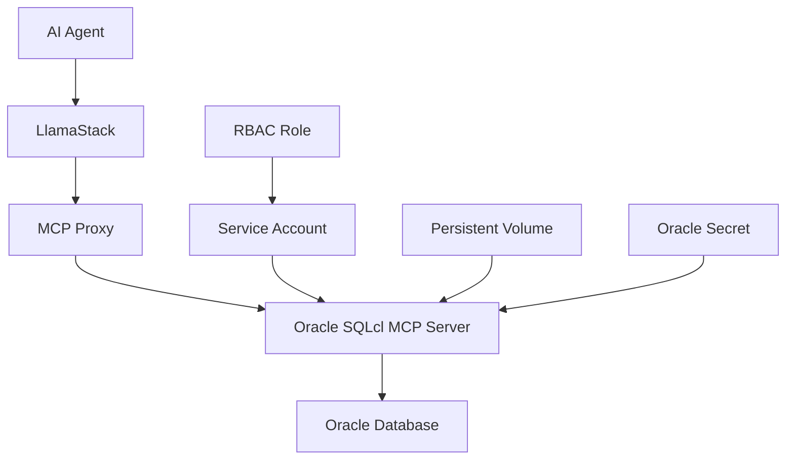

# Oracle SQLcl MCP Server

## 🚀 Overview

The Oracle SQLcl MCP Server enables AI agents to interact with Oracle databases through natural language queries. This server implements the Model Context Protocol (MCP) to provide database connectivity and SQL execution capabilities for AI-powered applications.

## ✨ Features

- **🔗 Database Connectivity**: Direct connection to Oracle databases using SQLcl
- **🤖 AI Integration**: Natural language to SQL query conversion
- **🔒 Secure Access**: Service account-based authentication with RBAC
- **💾 Persistent Storage**: 5Gi PVC for SQLcl home directory
- **⏱️ Dependency Management**: Init containers for Oracle secret and job validation
- **🛡️ Security**: Pod security contexts and capability restrictions

## 🏗️ Architecture



## 📋 Prerequisites

### Required Components
- **Oracle Database**: Oracle 23ai or compatible version
- **Toolhive Operator**: MCP server lifecycle management
- **Kubernetes Cluster**: OpenShift or standard Kubernetes
- **Storage Class**: `gp3-csi` or compatible storage class

### Required Secrets
- **oracle23ai**: Contains Oracle database credentials
  - `password`: Oracle database password
  - `jdbc-uri`: Oracle JDBC connection string

## 🚀 Deployment

> **⚠️ Important Note: LLM Model Selection**
> 
> For Oracle MCP server deployments, we recommend:
> - **Development/Testing**: Use the **8B model** (Llama-3.1-8B-Instruct) for faster iteration and lower resource requirements
> - **Production Use Cases**: Use the **70B model** (Llama-3.3-70B-Instruct) for superior response quality, better SQL generation accuracy, and more reliable natural language to SQL query conversion
> 
> The 70B model provides significantly better performance in understanding complex business requirements and generating correct SQL queries from natural language inputs. The 8B model is enabled by default with `ORACLE=true`, but you can configure the 70B model for production deployments by updating the model configuration in your Helm values.

### Quick Start

1. **Set Environment Variables**:
   ```bash
   export ADMIN_USERNAME=your-admin
   export ADMIN_EMAIL=your-email@company.com
   export HF_TOKEN=your-huggingface-token
   export NAMESPACE=your-namespace
   export ORACLE=true
   ```

2. **Deploy with Oracle Integration**:
   ```bash
   cd ai-virtual-agent/deploy/cluster
   make install NAMESPACE=$NAMESPACE ORACLE=true
   ```

### Manual Configuration

#### Enable Oracle MCP Server
```yaml
# In mcp-servers/helm/values.yaml
mcp-servers:
  oracle-sqlcl:
    enabled: true
    image: "quay.io/ecosystem-appeng/oracle-sqlcl:0.2.0"
    createServiceAccount: true
    serviceAccountName: oracle-sqlcl-sa
```

#### Resource Configuration
```yaml
resources:
  requests:
    cpu: 1000m
    memory: 4Gi
  limits:
    cpu: 2000m
    memory: 8Gi
```

#### Storage Configuration
```yaml
persistence:
  enabled: true
  volumeName: sqlcl-data
  accessMode: ReadWriteOnce
  size: 1Gi
  storageClassName: gp3-csi
```

## 🔧 Configuration

### Environment Variables

| Variable | Description | Default | Required |
|----------|-------------|---------|----------|
| `ORACLE_USER` | Oracle database user | `SYSTEM` | ✅ |
| `ORACLE_PASSWORD` | Oracle database password | From secret | ✅ |
| `ORACLE_CONNECTION_STRING` | JDBC connection string | From secret | ✅ |
| `ORACLE_CONN_NAME` | Named connection name | `oracle_connection` | ✅ |
| `JAVA_TOOL_OPTIONS` | JVM options | `-Djava.io.tmpdir=/sqlcl-home/tmp` | ❌ |
| `HOME` | SQLcl home directory | `/sqlcl-home` | ❌ |

### Service Account Configuration

The Oracle MCP server uses a dedicated service account with the following permissions:

```yaml
# Service Account
apiVersion: v1
kind: ServiceAccount
metadata:
  name: oracle-sqlcl-sa
  namespace: your-namespace

# Role
apiVersion: rbac.authorization.k8s.io/v1
kind: Role
metadata:
  name: oracle-sqlcl-oracle-wait
rules:
- apiGroups: [""]
  resources: ["secrets", "pods"]
  verbs: ["get", "list", "watch"]

# RoleBinding
apiVersion: rbac.authorization.k8s.io/v1
kind: RoleBinding
metadata:
  name: oracle-sqlcl-oracle-wait
subjects:
- kind: ServiceAccount
  name: oracle-sqlcl-sa
roleRef:
  kind: Role
  name: oracle-sqlcl-oracle-wait
```

## 🧪 Testing

### 1. Verify Deployment
```bash
# Check MCP server pod
oc get pods -l app.kubernetes.io/name=oracle-sqlcl

# Check service account
oc get serviceaccount oracle-sqlcl-sa

# Check RBAC
oc get role oracle-sqlcl-oracle-wait
oc get rolebinding oracle-sqlcl-oracle-wait
```

### 2. Test Database Connection
```bash
# Port forward to MCP server
oc port-forward oracle-sqlcl-0 8080:8080

# Test connection (if curl is available)
curl -X POST http://localhost:8080/health
```

### 3. Test AI Integration
1. **Access AI Virtual Agent**: Navigate to the application URL
2. **Select Oracle Agent**: Choose the Oracle MCP agent template
3. **Test Query**: Ask "Show me all customers with age above 50"
4. **Verify Response**: Check that SQL is generated and executed

## 🔍 Troubleshooting

### Common Issues

#### 1. MCP Server Not Starting
```bash
# Check pod logs
oc logs oracle-sqlcl-0 -c mcp

# Check init container logs
oc logs oracle-sqlcl-0 -c wait-for-oracle23ai
```

#### 2. Database Connection Failed
- **Verify Oracle secret exists**: `oc get secret oracle23ai`
- **Check connection string**: `oc get secret oracle23ai -o yaml`
- **Validate Oracle database**: Ensure database is accessible

#### 3. Permission Denied
- **Check service account**: `oc get serviceaccount oracle-sqlcl-sa`
- **Verify RBAC**: `oc describe role oracle-sqlcl-oracle-wait`
- **Check role binding**: `oc describe rolebinding oracle-sqlcl-oracle-wait`

#### 4. Storage Issues
- **Check PVC status**: `oc get pvc oracle-sqlcl-0-sqlcl-data`
- **Verify storage class**: `oc get storageclass gp3-csi`
- **Check pod events**: `oc describe pod oracle-sqlcl-0`

### Debug Commands

```bash
# Get detailed pod information
oc describe pod oracle-sqlcl-0

# Check MCP server status
oc get mcpserver oracle-sqlcl -o yaml

# View toolhive operator logs
oc logs -l app.kubernetes.io/name=toolhive-operator

# Check Oracle database connectivity
oc exec oracle-sqlcl-0 -c mcp -- sql -S -name oracle_connection
```

## 📊 Monitoring

### Key Metrics
- **Pod Status**: `oc get pods -l app.kubernetes.io/name=oracle-sqlcl`
- **Resource Usage**: `oc top pod oracle-sqlcl-0`
- **Storage Usage**: `oc get pvc oracle-sqlcl-0-sqlcl-data`

### Health Checks
- **Liveness Probe**: HTTP GET `/health` on port 8080
- **Readiness Probe**: HTTP GET `/health` on port 8080
- **Startup Probe**: Not configured (relies on init containers)

## 🔒 Security Considerations

### Pod Security
- **Non-root user**: Runs as non-root user
- **Read-only root filesystem**: Enabled where possible
- **Capability restrictions**: Drops all capabilities
- **Security context**: Configured for OpenShift compliance

### Network Security
- **Service account**: Dedicated service account for Oracle access
- **RBAC**: Minimal required permissions
- **Secret management**: Oracle credentials stored in Kubernetes secrets

### Data Protection
- **Persistent storage**: Encrypted PVC for SQLcl home directory
- **Connection security**: JDBC connection strings support SSL
- **Credential rotation**: Supports secret updates without pod restart

## 🚀 Advanced Configuration

### Custom SQLcl Configuration
```yaml
env:
  JAVA_TOOL_OPTIONS: "-Xmx2g -Djava.io.tmpdir=/sqlcl-home/tmp"
  _JAVA_OPTIONS: "-XX:+UseG1GC"
```

### Custom Wait Conditions
```yaml
waitFor:
- name: custom-oracle-secret
  type: secret
  timeout: 600
  interval: 10
```

### Resource Scaling
```yaml
resources:
  requests:
    cpu: 2000m      # Increase for heavy workloads
    memory: 8Gi     # Increase for large datasets
  limits:
    cpu: 4000m
    memory: 16Gi
```

## 📚 References

- [Oracle SQLcl MCP Server Documentation](https://docs.oracle.com/en/database/oracle/sql-developer-command-line/25.2/sqcug/using-oracle-sqlcl-mcp-server.html) - Official Oracle documentation for SQLcl MCP Server
- [Oracle SQLcl Documentation](https://docs.oracle.com/en/database/oracle/sql-developer-command-line/)
- [Model Context Protocol Specification](https://modelcontextprotocol.io/)
- [Toolhive Operator Documentation](https://github.com/stacklok/toolhive)
- [Kubernetes RBAC Guide](https://kubernetes.io/docs/reference/access-authn-authz/rbac/)

## 🤝 Contributing

1. **Fork the repository**
2. **Create a feature branch**: `git checkout -b feature/oracle-mcp-enhancement`
3. **Make your changes**
4. **Test thoroughly**
5. **Submit a pull request**

## 📄 License

This project is licensed under the Apache License 2.0 - see the [LICENSE](../../LICENSE) file for details.

---